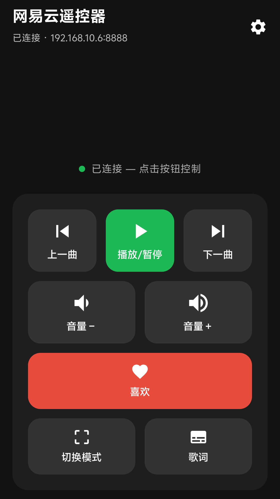
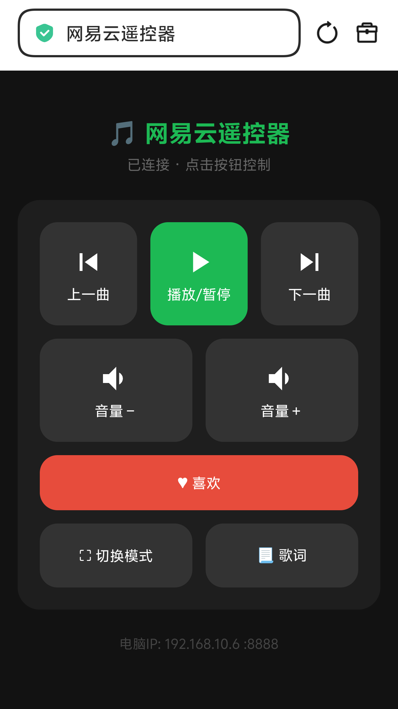

# 网易云音乐远程控制器


<div align="center">
  <table><tr>
    <td></td>
    <td></td>
  </tr></table>
</div>

> 用手机控制电脑上的 **网易云音乐** — Android App 和手机浏览器双端支持

本项目包含两部分：

| 组件 | 位置 | 说明 |
|------|------|------|
| 🖥 **Windows 服务端** | `server/` | Python HTTP 服务，模拟键盘快捷键 |
| 📱 **Android App** | `CloudMusicController/` | Jetpack Compose 桌面遥控界面 |

## 功能一览

| 功能 | Android App | 手机浏览器 |
|------|:-----------:|:----------:|
| ⏮ 上一曲 / ▶ 播放暂停 / ⏭ 下一曲 | ✅ | ✅ |
| 🔊 音量加减 | ✅ | ✅ |
| ♥ 喜欢当前歌曲 | ✅ | ✅ |
| ⛶ 切换窗口模式 | ✅ | ✅ |
| 📃 开关桌面歌词 | ✅ | ✅ |

## 快速开始

### 1. 启动服务端（Windows）

```bash
cd server
pip install -r requirements.txt
# ⚠ 务必以「管理员身份」运行
python server.py
```

服务端启动后，会显示本机局域网 IP 地址。

### 2. 连接控制

**方式 A — 手机浏览器**

在同一 WiFi 下，手机浏览器访问：

```
http://电脑IP:8888
```

> 端口可在 `server.py` 中修改，默认为 `8888`

**方式 B — Android App**

<p align="center">
  
</p>

- 安装 App，点击右上角 ⚙ 输入电脑 IP
- 点击连接，成功后即可遥控

## 技术栈

**Android App**
- Kotlin + Jetpack Compose (Material3)
- OkHttp 网络请求
- ViewModel + StateFlow 状态管理

**服务端**
- Python 标准库 http.server
- keyboard 库模拟全局快捷键
- 全平台兼容（仅服务端需要 Windows）

## 提示

- 服务端必须**以管理员身份运行**，否则无法模拟键盘操作
- 网易云音乐的快捷键可在「设置 → 快捷键」中自定义，对应修改 `server.py` 中的 `COMMANDS` 字典即可
- 手机和电脑必须在**同一局域网**下
